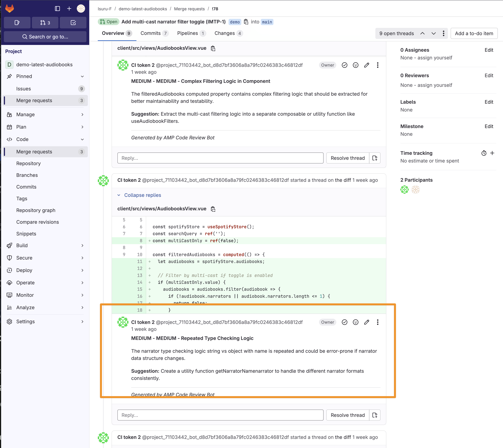

# GitLab Code Review Bot with Amp

This guide shows how to set up an automated code review bot using Amp that creates discussions on merge requests with a prompt you can configure to suit your repo's specific requirements. 


## How it Works

1. **Trigger**: Runs on every merge request opened or updated
2. **Diff Generation**: Extracts changes between base and head commits using GitLab API
3. **Analysis**: Feeds the diff to Amp CLI with a structured prompt
4. **Discussion Creation**: Parses Amp's output and creates inline MR discussions
5. **Cleanup**: Resolves previous bot discussions to avoid clutter

## Exanple 

### Live example 
https://gitlab.com/Isuru-F/demo-latest-audiobooks/-/merge_requests/78

### Example output


## Setup Instructions

### 1. Add the CI Configuration

Add `.gitlab-ci.yml` in your repository with the provided configuration.

### 2. Add the Discussion Script

Add `create_gitlab_discussions.js` to your repository. This script handles parsing Amp output and creating GitLab discussions.

### 3. Required Variables

Add these variables in your GitLab project's CI/CD settings:

- **`GITLAB_TOKEN`** - Personal/Project Access Token with `api` scope
- **`AMP_API_KEY`** - Your Amp API key from Sourcegraph

### 4. GitLab API Permissions

The bot uses these GitLab APIs:
- **Merge Requests API** - To fetch MR data and diff information
- **Discussions API** - To create inline comments and general discussions
- **Repository API** - To get commit SHAs and file changes

## Customizing the Review Prompt

Edit the prompt in the CI script to focus on specific areas:

```yaml
echo "Please analyze the following diff for:"
echo "- Missing or insufficient unit tests"        # ← Customize these
echo "- Security vulnerabilities"                  # ← focus areas
echo "- Performance issues"
echo "- Code quality problems"
echo "- Architecture concerns"
echo "- Best practices violations"
```

## Output Format

The bot expects Amp to return structured feedback in this format:

```
**Severity: [HIGH|MEDIUM|LOW]**

### Issues Found:

1. **🔴 HIGH - [Issue Title]**
   - FILE: path/to/file.js
   - LINE: 42
   - DESCRIPTION: [Issue description]
   - SUGGESTION: [How to fix]
```

## Key Features

- **Inline Discussions**: Creates specific line-by-line feedback on changed code
- **Severity Levels**: Categorizes issues by priority (🔴 HIGH, 🟡 MEDIUM, 🟢 LOW)
- **Auto-cleanup**: Resolves previous bot discussions on new commits
- **Diff-aware**: Only comments on changed lines in the MR
- **Fallback Handling**: Creates general discussions if inline positioning fails

## File Structure

Your repository should contain:

```
.gitlab-ci.yml                    # CI configuration
create_gitlab_discussions.js      # Discussion creation script
```

## Requirements

- Node.js 22+ (handled by CI image)
- Valid Amp API key
- GitLab project with CI/CD enabled
- Proper token permissions (`api` scope)

## Differences from GitHub Version

- Uses **GitLab Discussions API** instead of GitHub Review Comments
- Requires **SHA positioning** for inline comments (base_sha, head_sha, start_sha)
- Uses **merge request events** instead of pull request events
- **Auto-resolves** previous discussions instead of dismissing reviews

The bot will automatically review all future merge requests and provide actionable feedback to improve code quality.
